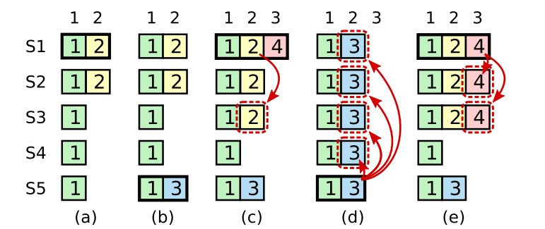

## Leader election
Watch this video: https://www.youtube.com/watch?v=9sT03jEwcaw to have a general idea of raft.
Then read RAFT 5.1, 5.2 and page 3.
This should be the easiest part of raft.
And remember a few details:

1. To generate a random election timeout in different goroutines, set proper seed for `rand`.
A common mistake is
```go
rand.Seed(time.Now().UnixNano())
randomDelay := rand.Int63n(rf.maxDelay-rf.minDelay) + rf.minDelay
time.Sleep(time.Duration(randomDelay) * time.*Millisecond)
```
Because the goroutines are running almost at the same time, the seed is the same.
One way is to use 'rf.me' as the seed.

2. Sending vote request in parallel and counting votes asynchronously.
If not, then under situation that some servers are having network problems, 
the leader will be elected very slowly (you have to wait for RPC timeout to determine peer voting or not). 

Of course, setting a proper timeout can also solve this problem, 
but it seems guider doesn't want us to do this according to the comment in `raft.go`:
```go
// Call() is guaranteed to return (perhaps after a delay) *except* if the
// handler function on the server side does not return.  Thus there
// is no need to implement your own timeouts around Call().
```

## Log replication


Q: why a leader can only commit log entries from its current term?

A: In pic above, S1 is replaced by S5 as the leader in (b), and this election satisfies the 5.4.1 election restriction.
Then, S5 receive entry 3, after this, S5 crashes, and S1 becomes the leader again in (c).
If S1 can commit entry 3, then S5 can still be the leader in (d) according to 5.4.1 election restriction.
After S5 being elected, S5 begins to replicate entry 3 to S1, but S1 has already committed entry 2 at index 2.
Namely, S1 is trying to change some entry already committed. It causes inconsistency.

Q: why a leader cannot determine commitment using log entries from older terms?

A: At the very beginning, I don't think this question makes any sense, as we always use commitIndex to determine commitment.  

After thinking, I realize that it is exactly "leader cannot determine commitment using log entries from older terms" 
that makes 'commitIndex' field necessary.

Failed for Rejoin:
Attention when sending entries: isLeader should be constructed in the same lock as args to ensure consistency.

Failed for RPC count:
Leader is given a series of entries to replicate, and it will send RPC to followers.
And leader actually send them in first rounds. However, because of my design, even all entries are sent, 
leader would still give it a try for each arrived command. No doubt, these AppendEntries RPC will contain no entries.
Follower mistakenly treat them as heartbeat, and didn't set `reply.Success = true` (this is my negligence).
So, leader falsely think that it failed to replicate entries, and it will increase nextIndex and retry.

In short, there are two mistakes I did. First of all, leader should check whether there are entries to replicate.
Secondly, follower should set `reply.Success = true` when it receives heartbeat. With either of them, it will work normally.
I prefer the second one, because it is more consistent with the original design.

`TestConcurrentStarts2B` failed once while running it every 500 times.
It is caused by the follower not synced with leader but still trying to commit entries.

## Persistence
This part is simple, but there is a test `TestFigure8Unreliable2C` hard to pass.
```log
2023/08/15 22:03:31 3 send append entries to 0 failed
2023/08/15 22:03:31 1 send append entries to 0 failed
2023/08/15 22:03:32 1 send append entries to 3 failed
2023/08/15 22:03:32 1 send append entries to 4 failed
2023/08/15 22:03:32 3 send append entries to 2 failed
2023/08/15 22:03:32 1 send append entries to 3 failed
2023/08/15 22:03:35 1 send append entries to 4 failed
2023/08/15 22:03:36 1 send append entries to 2 failed
2023/08/15 22:03:38 1 send append entries to 3 failed
2023/08/15 22:03:39 1 send append entries to 4 failed
2023/08/15 22:03:39 1 send append entries to 4 failed
2023/08/15 22:03:39 1 send append entries to 4 failed
2023/08/15 22:03:39 1 send append entries to 4 failed
```
Above log shows that the network is really unstable TestFigure8Unreliable2C.
After reading a more detailed log, I find that the leader is not able to commit entries.
It seems it took too long time for leader to sync committed logs to followers.
The bug existed in `* b2ed23c finnish raft 2B`, the commitIndex update method does have its problem.
Now I use a `updateCommitIndex` function to update commitIndex, and it works.
However, broadcast entries should also be changed. 
Broadcast new entries and heartbeat should be merged into one function(not implemented though). 
More specifically, the leader send heartbeat periodically, 
if there are new entries to replicate, then send them, otherwise, send AppendEntries with no entries.

## Snapshot
Snapshot means some log entries are no longer needed(these logs can be compressed), 
thus we can take a snapshot and discard these entries.
First tricky thing is how do we trim the log. 
To make things simpler, I will just call `the original log` as original log, and `the log with snapshot` as real log.
`lastIncludeIndex` is always an index on the original log.
An example is shown below:

| original log | index0 | index1 | index2 | index3 | index4 | index5 | index6 |
|--------------|--------|--------|--------|--------|--------|--------|--------|
| Command      | 0      | 1      | 2      | 3      | 4      | 5      | 6      |
| Term         | 0      | 1      | 1      | 1      | 1      | 1      | 1      |

Suppose we take a snapshot at index 5, then `lastIncludeIndex` becomes 3, and `lastIncludeTerm` becomes 1.
Then, the real log should be:

| real log | index0 | index1 | index2 | index3 |
|----------|--------|--------|--------|--------|
| Command  | 3      | 4      | 5      | 6      |
| Term     | 1      | 1      | 1      | 1      |

The first entry in real log is cmd 3, actually cmd 3 is included in the snapshot, but I still keep it in real log.
The reason is in my original log design, first entry is always empty.
To keep consistent with the original design, I just keep it and set it to empty later.

Then, we need to turn the index on the original log into the log with snapshot.
it can be express as IndexOrgLog = IndexRealLog + lastIncludeIndex, namely, IndexRealLog = IndexOrgLog - lastIncludeIndex.

In all, I call the real log before snapshot as $snapshot_1$, and the real log after snapshot as $log after snapshot_2$.
$snapshot_2 = snapshot_1[Index-lastIncludeIndex:]$, `index` is the parameter passed in `Snapshot` func, 
means the entry from 0 to Index(inclusive) on the original log should be included in the snapshot.

Then, the tricky thing is to decide how to change the code to fit the log with snapshot.
Generally, my strategy is to change the code as little as possible, I decide to just change 
how we access the log, and how we update the log. 
Another reason is that different raft nodes may take snapshot at different time, namely the log are trimmed 
at different log index. 
If we send the real index to follower, then follower will get confused, because the log on leader is different from follower.

Let's consider it line by line.
1. Vote process: seems no change.
2. Log replication: How does leader broadcast AppendEntries RPC to followers, and how should follower respond.
3. Heartbeat: care about commitIndex, it is the index on the original log, and should be changed.

Potential deadlock:
in commit `5617c70`, snapshot will be taken when there are too many logs committed instinctively. 
This happens after you send a applyMsg to the state machine. Then test code will call snapshot(), which also requires lock.
However, while sending applyMsg, the raft is already locked. Thus deadlock happens.

I need to make a few changes, but due to the reason that my applyLog function is not well-designed (it will only be called 
after leader or follower update commitIndex) and releasing lock makes my code look ugly. 
I finally decide to set another goroutine to run applyLog.

At very beginning, I have some misunderstanding about snapshot. I thought I have to store the snapshot inside raft leader.
Well actually, the snapshot is stored in state machine.

